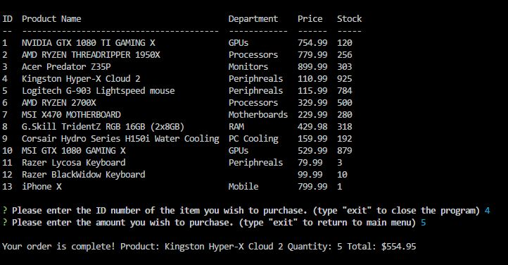
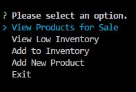
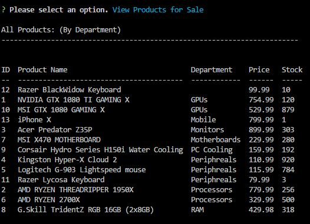
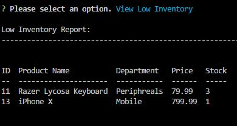
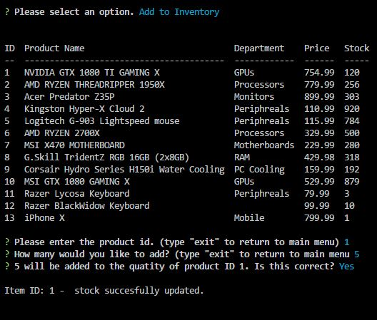
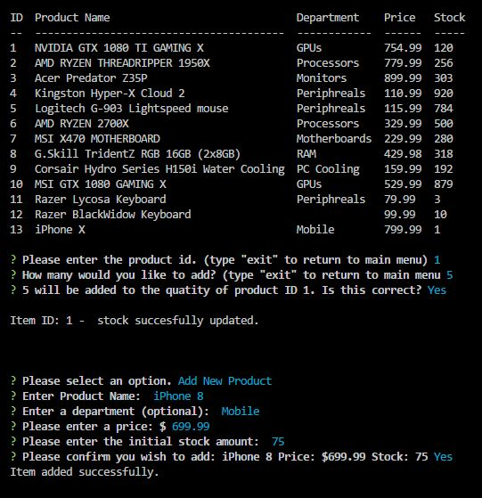

# **Bamazon**

## **What is Bamazon?**

Bamazon is an inventory managment and ordering program that will be able to help businesses keep track of inventory and fulfill electronically submitted orders automatically. Thus, providing more accurate, up to date inventory information and faster order fulfillment allowing for increased sales productivity.

## **Installing Bamazon:**

* Bamazon is a command line interface progam. In order to install bamazon simply download the files to your system then follow these steps.

1. Update bamazonManager.js and customer.js connection with the user name and password you wish to use to access your database. The database name defaults to bamazonDB, this should also be updated if you wish to use a different database name.

2. Use npm install to download and install the required npm packages.

3. Start your server, the files are configured to use localhost port 3306.

4. A .sql file has been provided that you may use to construct a database on your server with the appropriate columns.

5. You may either populate the database with the products you wish to use or you may import the provided Seed.csv to your database for testing purposes.

6. Launch the file you wish to use in the command line using node/bamazonManager.js for manager view or node/customer.js for customer view.

## **How to use Bamazon:**

### **Customer View:**

This image below demonstrates the basic flow a user will follow using the customer view:

1. User will be presented with a list of all available items with important info.
2. Customer will be asked to provide ID number of item they wish to purchase.
3. Customer will be asked to provide the quantity they wish to purchase.
4. Database will be updated and customer will recieve an order confirmation and final cost.

### **Manager View:**

The manager view will allow access to important information and inventory managment functions.

1. The user will be presented with a list of possible options.

2. If the user selects view products, a comprehensive list of all products for sale will be displayed and sorted by department.

3. If the user selects low inventory, a list of all items will less than 5 items remaining in stock will be displayed.

4. If the user selects add inventory, the program will request the ID of the item the wish to update and the quantity they wish to add to the current stock.

5. If the user selects add product, the program wil request the relevant information required to add the product and then add that item to the database after a confirmation.

## Contributors ##

Angel Martinez
